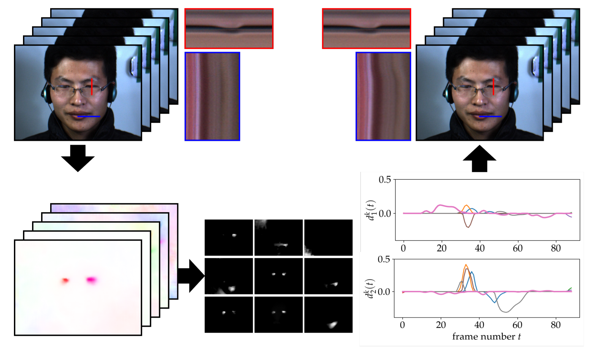

# Sparse PCA-based Lagrangian Motion Magnification on Faces

The implementation of landmark-based, selective motion magnification can be found [here](https://github.com/phflot/momag). The sparse PCA-based decomposition and demo has been implemented by @cosmas-heiss and the RAFT training on faces for micro-expressions by @phflot.



## Requirements

Setup anaconda via ```conda env create -f environment.yml```. To reproduce the demo recording, the file EP04_04f.avi from the CASME II microexpression dataset is required.

## Citation

If you use this code for your work, please cite
  
> P. Flotho, C. Heiss, G. Steidl, and D. J. Strauss, “Lagrangian Motion Magnification with Double Sparse Optical Flow Decomposition,” arXiv preprint arXiv:2204.07636 (2022).

BibTeX entry
```
@article{flotea2022c,
  doi = {10.48550/ARXIV.2204.07636},  
  author = {Flotho, P. and Heiss, C. and Steidl, G. and Strauss, D. J.},
  title = {Lagrangian Motion Magnification with Double Sparse Optical Flow Decomposition},
  journal = {arXiv},
  year = {2022},
  copyright = {Creative Commons Zero v1.0 Universal},
}
```